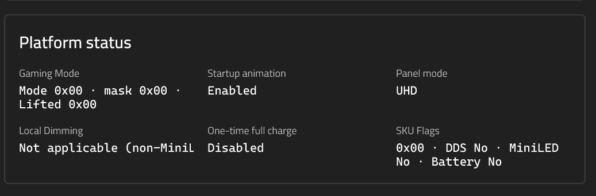
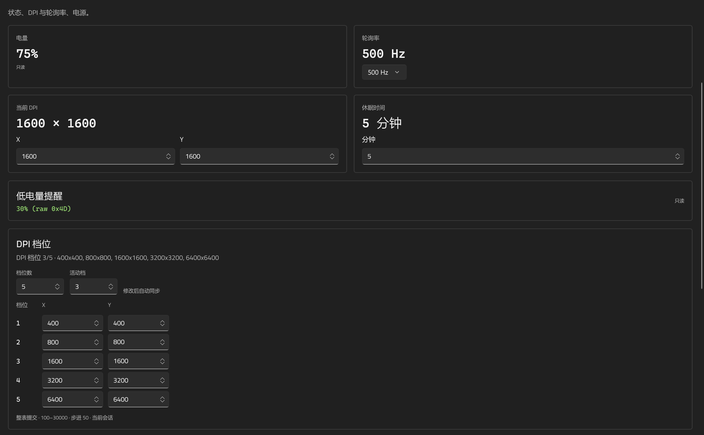
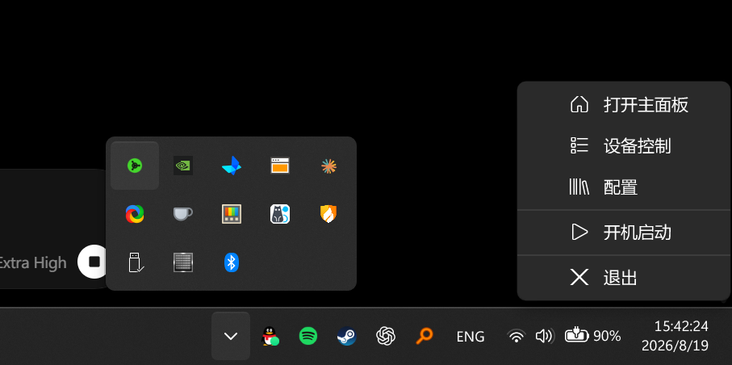

# OpenSynapse

English | [简体中文](README.md)

OpenSynapse is a lightweight Razer device controller for Windows 11. It manages verified lighting, performance, and everyday device settings without requiring Razer Synapse to remain running.

The current release is `0.1.0` and supports only the exact devices verified on hardware. OpenSynapse does not infer protocols from similar model names and does not send control commands to unknown devices.

## Supported devices

| Device | USB VID:PID | Status |
|---|---|---|
| Razer Blade 16 (2025) | `1532:02C6` | Supported |
| Razer Viper V3 HyperSpeed | `1532:00B8` | Supported |

Other Razer devices do not inherit these protocols automatically, even when their names or designs are similar. A new device requires its own manifest, protocol evidence, and readback validation.

## Features

### Blade 16 (2025)

- Read CPU, GPU, memory, storage, fan, and device status.
- Adjust keyboard brightness.
- Use 13 keyboard effects: Off, Static, Breathing, Spectrum, Wave, Fire, Reactive, Ripple, Audio Meter, Ambient, Wheel, Starlight, and two-color Tidal.
- Set the chassis logo to Off, Static, or Breathing.
- Select performance modes and configure CPU Boost, GPU Boost, and Max Fan in Custom mode.
- Set a charge limit from `50%` to `80%`, or disable the limit.
- Select a refresh rate supported by the Windows internal display.
- Toggle the touchpad through the Windows system setting.
- Handle verified Fn media keys, display-brightness keys, M3 Gaming Mode, and the M5 microphone-mute indicator in the background.
- Adjust the verified Gaming Mode, startup-animation, and one-time-full-charge switches. Each write is capability-gated and restores the last confirmed value on failure.
- Show panel mode, SKU, Local Dimming, and other platform fields as read-only state.

Wave, Fire, and Wheel use recovered algorithms, but have not completed frame-by-frame visual parity checks against Synapse and are not presented as 1:1 reproductions.

### Viper V3 HyperSpeed

- Read battery level, low-battery threshold, polling rate, current DPI, sleep timeout, and the complete DPI-stage table.
- Set `125 / 500 / 1000 Hz` polling.
- Set X/Y DPI from `100..30000` in steps of `50`.
- Configure the sleep timeout and up to five DPI stages.
- Read and edit Normal / HyperShift onboard mappings in fixed Profile 1.
- Map Off, mouse buttons, keyboard keys, double-click, DPI cycle, play/pause, HyperShift, keyboard Turbo, and mouse Turbo actions.

The low-battery threshold is read only. This device does not support `2000 / 4000 / 8000 Hz` HyperPolling.

### Application

- Create, clone, rename, delete, import, and export local profiles.
- Switch profiles when the foreground application or power source changes.
- Run in the system tray and start with Windows for the current user.
- Show live CPU, NVIDIA GPU, memory, and storage telemetry.
- Use the interface in Chinese or English.
- Write rotating local diagnostics to `%LocalAppData%\OpenSynapse\logs\opensynapse.log`.

## Screenshots








## Install and run

1. Download the latest x64 archive from [Releases](https://github.com/A1mAssist/OpenSynapse/releases).
2. Extract the complete archive. Do not move the executable by itself or remove the adjacent `resources` directory.
3. Run `OpenSynapse.exe` from the archive root.

Exit Razer Synapse before the first device scan. Both applications can contend for the same HID control channel. OpenSynapse reports access failures but never terminates the Synapse process.

Fn media keys and the M3/M5 indicator synchronization require Razer AppEngine to be installed on the machine. Razer's proprietary `mapping_engine.dll` is not distributed in this repository or in release bundles; the app remains usable without it, with those background features disabled.

## Relationship to Razer Synapse

OpenSynapse can handle the everyday features listed above without Synapse running, but it is not a complete replacement for the vendor application. The following areas are deliberately out of scope:

- Firmware updates and Razer account or cloud services.
- THX Spatial Audio, EQ, volume leveling, and voice clarity.
- Chroma Studio and macro editors.
- GPU MUX, AMD Curve Optimizer, and unverified battery-policy writes.
- Production writes for Blade fixed fan speed and smart fan curves.
- Viper low-battery threshold, battery type, and `2K / 4K / 8K` polling writes.

## Safety model

A hardware write is enabled only after a successful read on the current device path. Write transactions perform readback and restore the last confirmed state after failure or cancellation. Controls remain disabled when a device disconnects, access is denied, or readback is incomplete.

See the [device capability matrix](docs/device-capability-matrix.md) for protocol status and capability boundaries. Hardware captures and local validation output are intentionally excluded from the repository; reverse-engineering notes are not automatic production write access.

## Build from source

Building requires Windows 11 x64, the .NET 10 SDK, and Windows SDK `10.0.26100`.

```powershell
dotnet restore OpenSynapse.slnx
dotnet build OpenSynapse.slnx -c Release
dotnet build src/OpenSynapse.App/OpenSynapse.App.csproj -c Release -p:Platform=x64
dotnet test tests/OpenSynapse.Core.Tests/OpenSynapse.Core.Tests.csproj -c Release -p:Platform=x64
```

Run the local build:

```powershell
& '.\src\OpenSynapse.App\bin\x64\Release\net10.0-windows10.0.26100.0\OpenSynapse.App.exe'
```

Default tests do not write to hardware. Hardware tests must be enabled explicitly and read back and restore changed values before completion:

```powershell
$env:OPENSYNAPSE_HARDWARE_TEST = '1'
dotnet test tests/OpenSynapse.Core.Tests/OpenSynapse.Core.Tests.csproj -c Release -p:Platform=x64 --filter 'Category=Hardware'
```

## Repository layout

- `src/OpenSynapse.App`: WinUI 3 interface, tray lifecycle, profiles, and user interactions.
- `src/OpenSynapse.Core`: device, profile, display, and telemetry contracts.
- `src/OpenSynapse.Windows`: Windows HID, device protocols, lighting, audio, and system integration.
- `tests/OpenSynapse.Core.Tests`: protocol bytes, boundaries, readback, restoration, and lifecycle tests.
- `docs`: capability matrix, front-end contracts, and protocol evidence.

## License and acknowledgements

Project code is available under the [MIT License](LICENSE). Third-party components and bundled resources remain subject to their own licenses and distribution terms.

Protocol work references and cross-checks [OpenRazer](https://github.com/openrazer/openrazer), [OpenRGB](https://gitlab.com/CalcProgrammer1/OpenRGB), and other public implementations. OpenSynapse is not affiliated with or endorsed by Razer Inc. Razer and related product names are trademarks of their respective owners.

Made with ❤ in C# by [A1mAssist](https://github.com/A1mAssist).
