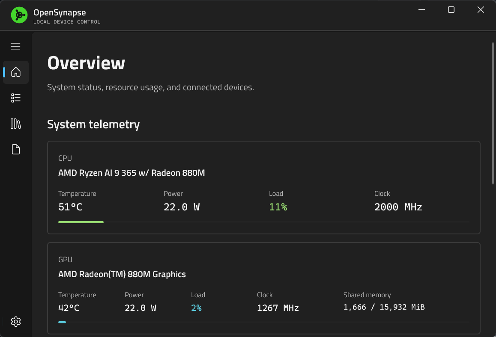
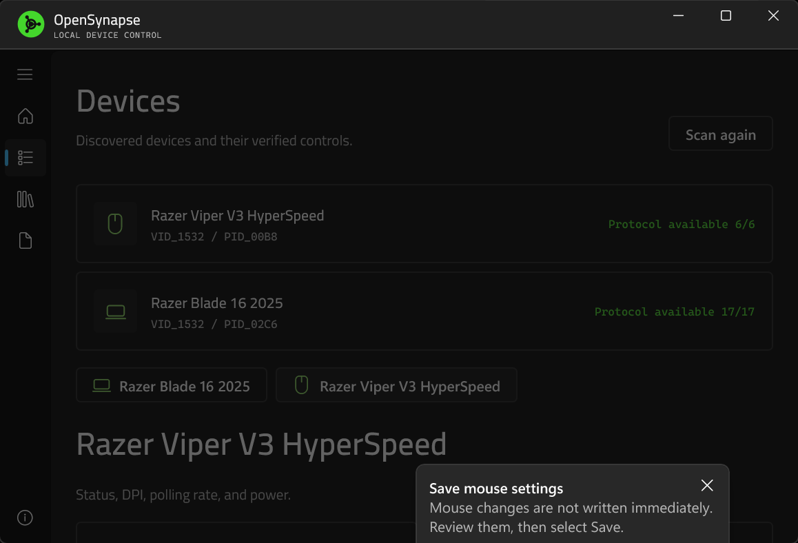
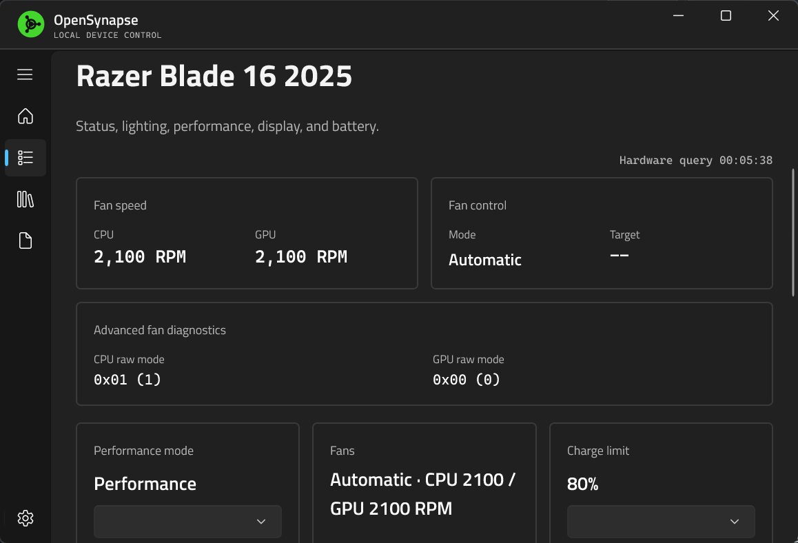
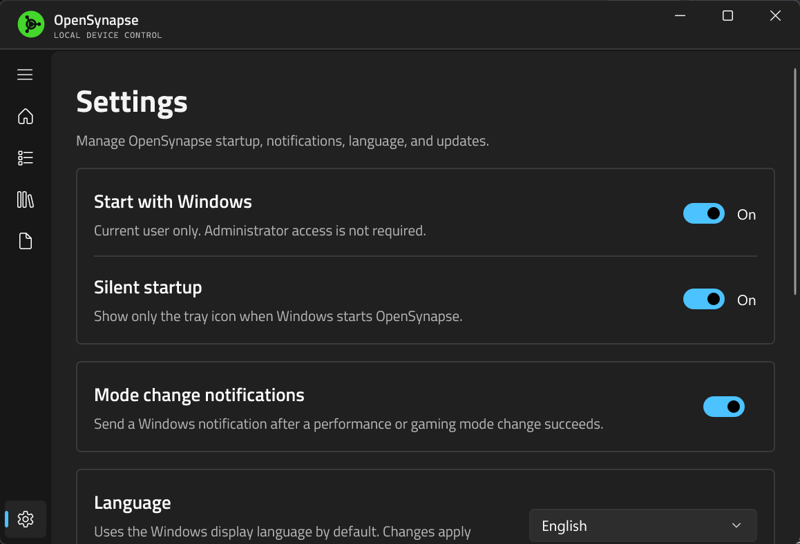

<p align="center">
  
</p>

<h1 align="center">OpenSynapse</h1>

<p align="center">A lightweight Razer device controller for Windows 11.</p>

<p align="center">
  <a href="https://github.com/A1mAssist/OpenSynapse/releases/latest"></a>
  <a href="LICENSE"></a>
  
</p>

<p align="center"><a href="README.zh-CN.md">简体中文</a> · English</p>

OpenSynapse reads device state and manages hardware-verified lighting, performance, display, battery, and key functions without keeping Razer Synapse running. It never infers protocols from similar model names or sends control commands to unknown devices.

> Current stable release: `v1.1.2`. Only the exact hardware and USB identifiers listed below are supported.

## Supported devices

| Device | USB VID:PID | Verified capabilities |
|---|---|---|
| Razer Blade 16 (2025) | `1532:02C6` | Telemetry, lighting, performance, fans, display, battery, Fn/M3/M4/M5 |
| Razer Viper V3 HyperSpeed | `1532:00B8` | Battery, DPI, polling, sleep, onboard button mappings |

## Features

### Razer Blade 16 (2025)

- Read CPU, GPU, memory, storage, fan, and device status.
- Adjust keyboard brightness and use Off, Static, Breathing, Spectrum, Wave, Fire, Reactive, Ripple, Audio Meter, Ambient, Wheel, Starlight, and two-color Tidal effects.
- Select performance modes and configure CPU Boost, GPU Boost, and Max Fan in Custom mode.
- Use automatic or manual fan control and set a charge limit from `50%` to `80%`.
- Select a refresh rate supported by the internal display and toggle the touchpad.
- Handle verified Fn shortcuts, M3 Gaming Mode, M4 performance mode, and the M5 microphone-mute indicator in the background.
- Show panel mode, SKU, and other platform fields as read-only state.

### Razer Viper V3 HyperSpeed

- Read battery level, low-battery threshold, polling rate, current DPI, sleep timeout, and DPI stages.
- Set `125 / 500 / 1000 Hz` polling.
- Set X/Y DPI from `100..30000` in steps of `50`, with up to five DPI stages.
- Read and edit Normal / HyperShift onboard mappings in fixed Profile 1.
- Use verified Off, mouse-button, keyboard-key, and double-click mapping actions.

The low-battery threshold remains read only. Viper V3 HyperSpeed does not support `2000 / 4000 / 8000 Hz` HyperPolling.

## Screenshots

| Overview | Devices |
|---|---|
|  |  |

| Blade controls | Settings |
|---|---|
|  |  |

## Installation

1. Download `OpenSynapse-win-Setup.exe` from [GitHub Releases](https://github.com/A1mAssist/OpenSynapse/releases/latest).
2. Run the installer. OpenSynapse installs for the current user and does not require administrator privileges.
3. For a no-install build, download `OpenSynapse-win-Portable.zip`. Automatic updates are intended for the installed build.

Exit Razer Synapse before the first device scan to avoid both applications contending for the same HID control channel. OpenSynapse reports access failures but never terminates the Synapse process.

### Driver boundary

OpenSynapse does not require Razer Synapse, AppEngine, or `mapping_engine.dll`. Blade Fn, M3, M4, and M5 support requires the Product 710 Razer device drivers. Install the matching drivers from Razer or your Blade device support package before using those functions; without them, Blade Fn and the related hardware controls remain unavailable. 

## Out of scope

- Firmware updates, Razer accounts, and cloud services.
- THX Spatial Audio, EQ, volume leveling, and voice clarity.
- Chroma Studio, advanced macro editing, GPU MUX, and AMD Curve Optimizer.
- Writes for devices or protocols that have not passed hardware validation.

## Build from source

Building requires Windows 11 x64, the [.NET 10 SDK](https://dotnet.microsoft.com/download/dotnet/10.0), and Windows SDK `10.0.26100`.

```powershell
dotnet restore OpenSynapse.slnx
dotnet build OpenSynapse.slnx -c Release
dotnet test OpenSynapse.slnx -c Release --no-build
dotnet build src/OpenSynapse.App/OpenSynapse.App.csproj -c Release -p:Platform=x64
```

Run the local build:

```powershell
& '.\src\OpenSynapse.App\bin\x64\Release\net10.0-windows10.0.26100.0\OpenSynapse.App.exe'
```

Release packages are not code signed, so Windows SmartScreen may display a warning.

## Contributing

Read [CONTRIBUTING.md](CONTRIBUTING.md) before submitting source, tests, or documentation. Build output, logs, captures, reverse-engineering workspaces, private keys, tokens, and machine-local configuration must never be committed.

## License and acknowledgements

Project code is available under the [MIT License](LICENSE). Third-party components and bundled resources remain subject to their own licenses and distribution terms.

Protocol work references and cross-checks [OpenRazer](https://github.com/openrazer/openrazer), [OpenRGB](https://gitlab.com/CalcProgrammer1/OpenRGB), and other public implementations. OpenSynapse is not affiliated with or endorsed by Razer Inc. Razer and related product names are trademarks of their respective owners.

Made with ❤ in C# by [A1mAssist](https://github.com/A1mAssist).

abc def ghi jkl mno pqr stu
abc def ghi jkl mno pqr stu
