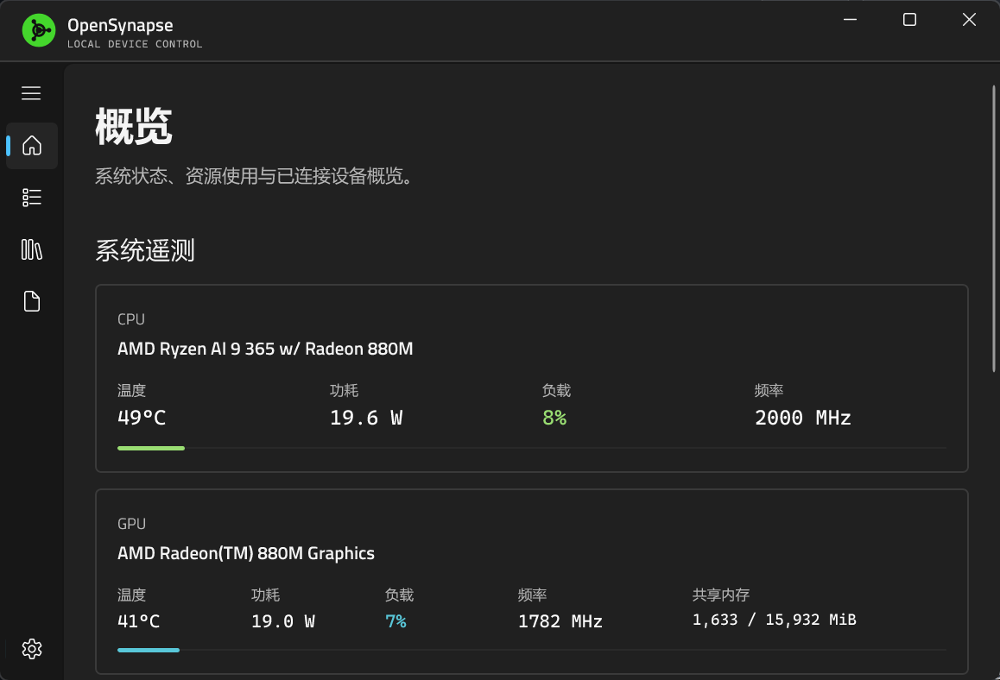
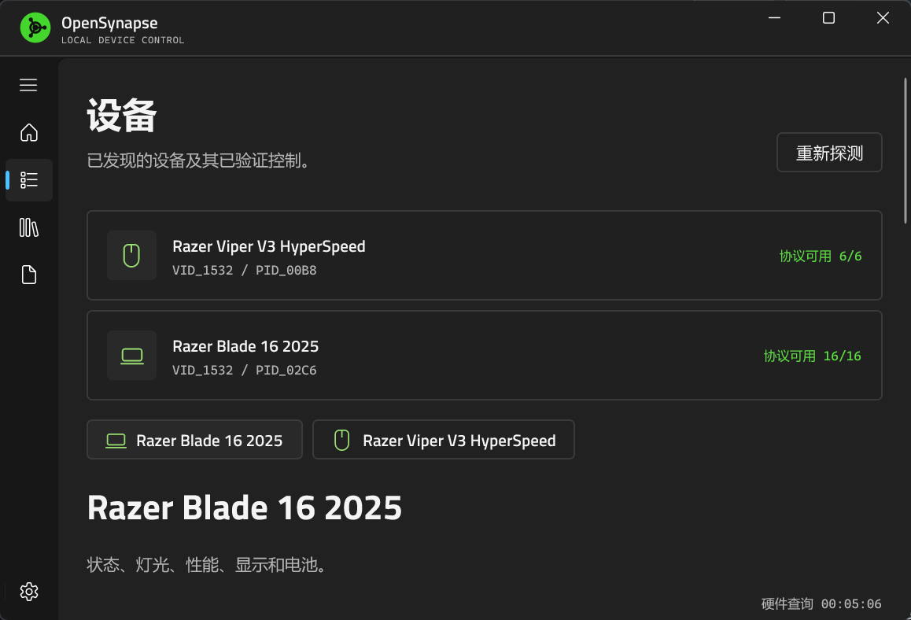
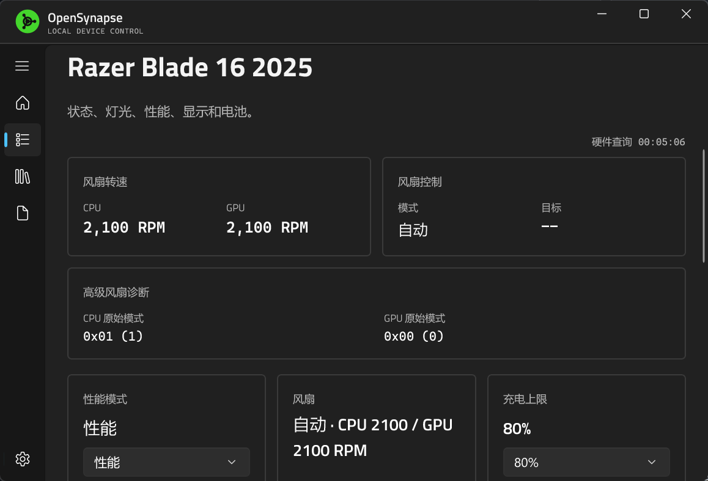
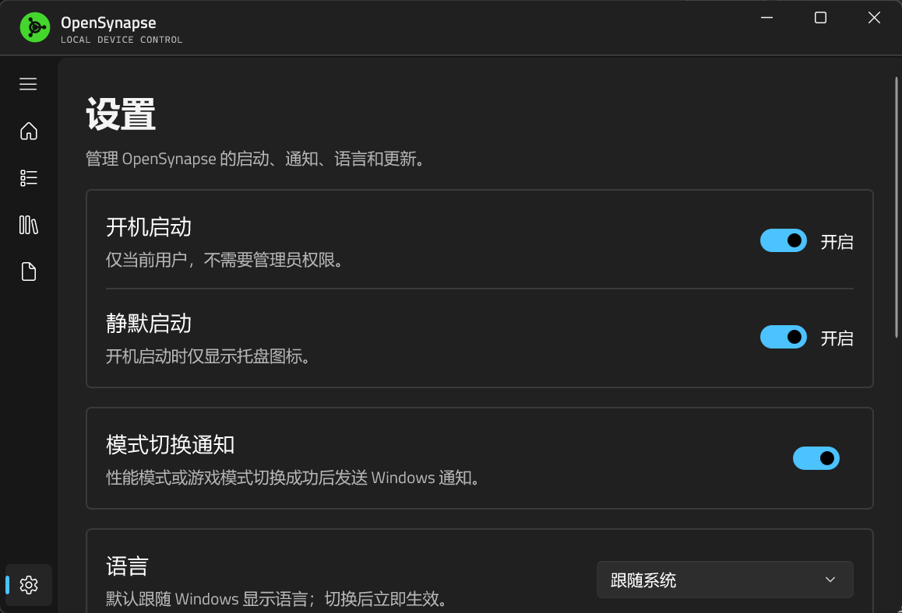

<p align="center">
  
</p>

<h1 align="center">OpenSynapse</h1>

<p align="center">面向 Windows 11 的轻量级 Razer 设备控制工具。</p>

<p align="center">
  <a href="https://github.com/A1mAssist/OpenSynapse/releases/latest"></a>
  <a href="LICENSE"></a>
  
</p>

<p align="center">简体中文 · <a href="README.md">English</a></p>

OpenSynapse 可以在不让 Razer Synapse 常驻的情况下，读取设备状态并管理经过实机验证的灯光、性能、显示、电池和按键功能。它不会根据相近型号猜测协议，也不会向未知设备发送控制命令。

> 当前稳定版本：`v1.1.0`。仅支持下方列出的具体硬件与 USB 标识。

## 支持设备

| 设备 | USB VID:PID | 已验证能力 |
|---|---|---|
| Razer Blade 16 (2025) | `1532:02C6` | 遥测、灯光、性能、风扇、显示、电池、Fn/M3/M4/M5 |
| Razer Viper V3 HyperSpeed | `1532:00B8` | 电量、DPI、轮询率、休眠、板载按键映射 |

## 功能

### Razer Blade 16 (2025)

- 读取 CPU、GPU、内存、磁盘、风扇和设备状态。
- 调整键盘亮度，并使用关闭、静态、呼吸、光谱循环、波浪、火焰、响应、涟漪、音频律动、环境感知、色轮、星光和双色潮汐灯效。
- 切换性能模式；在自定义模式下调整 CPU Boost、GPU Boost 和 Max Fan。
- 使用自动风扇或手动风扇控制，设置 `50%` 至 `80%` 的充电上限。
- 切换内置显示器支持的刷新率和触控板状态。
- 后台处理已验证的 Fn 组合键、M3 游戏模式、M4 性能模式以及 M5 麦克风静音指示灯。
- 显示面板模式、SKU 等只读平台状态。

### Razer Viper V3 HyperSpeed

- 读取电量、低电量阈值、轮询率、当前 DPI、休眠时间和 DPI 档位。
- 设置 `125 / 500 / 1000 Hz` 轮询率。
- 设置 `100..30000`、步进 `50` 的 X/Y DPI，并配置最多 5 档 DPI。
- 读取和编辑固定 Profile 1 的 Normal / HyperShift 板载映射。
- 支持关闭、鼠标键、键盘按键和双击等已验证映射动作。

低电量阈值保持只读；Viper V3 HyperSpeed 不支持 `2000 / 4000 / 8000 Hz` HyperPolling。

## 界面预览

| 概览 | 设备 |
|---|---|
|  |  |

| Blade 控制 | 设置 |
|---|---|
|  |  |

## 安装

1. 从 [GitHub Releases](https://github.com/A1mAssist/OpenSynapse/releases/latest) 下载 `OpenSynapse-win-Setup.exe`。
2. 运行安装包。应用安装到当前用户目录，不需要管理员权限。
3. 如需免安装使用，可下载 `OpenSynapse-win-Portable.zip`；自动更新功能仅面向安装版。

首次探测设备前建议退出 Razer Synapse，避免两个程序争用同一个 HID 控制通道。OpenSynapse 会报告访问失败，但不会结束 Synapse 进程。

### 驱动边界

OpenSynapse 不需要 Razer Synapse、AppEngine 或 `mapping_engine.dll`。Blade 的 Fn、M3、M4 和 M5 功能需要 Product 710 的 Razer 设备驱动。使用这些功能前，请从 Razer 或 Blade 对应的设备支持包安装匹配驱动；未安装驱动时，Blade Fn 和相关硬件控制会保持不可用。
## 当前不包含

- 固件更新、Razer 账号和云服务。
- THX Spatial Audio、EQ、音量均衡和语音清晰度。
- Chroma Studio、高级宏编辑器、GPU MUX 和 AMD Curve Optimizer。
- 未经实机验证的设备或协议写入。

## 从源码构建

需要 Windows 11 x64、[.NET 10 SDK](https://dotnet.microsoft.com/download/dotnet/10.0) 和 Windows SDK `10.0.26100`。

```powershell
dotnet restore OpenSynapse.slnx
dotnet build OpenSynapse.slnx -c Release
dotnet test OpenSynapse.slnx -c Release --no-build
dotnet build src/OpenSynapse.App/OpenSynapse.App.csproj -c Release -p:Platform=x64
```

运行本地构建：

```powershell
& '.\src\OpenSynapse.App\bin\x64\Release\net10.0-windows10.0.26100.0\OpenSynapse.App.exe'
```

发布包没有代码签名证书，Windows SmartScreen 可能显示警告。

## 参与贡献

提交源码、测试或文档前请阅读 [CONTRIBUTING.md](CONTRIBUTING.md)。构建输出、日志、抓包、逆向工程目录、私钥、令牌和本机配置不得提交到仓库。

## 许可与致谢

项目代码采用 [MIT License](LICENSE)。第三方组件和随附资源遵循各自的许可证与分发条款。

协议实现参考并交叉验证了 [OpenRazer](https://github.com/openrazer/openrazer)、[OpenRGB](https://gitlab.com/CalcProgrammer1/OpenRGB) 及其他公开实现。OpenSynapse 与 Razer Inc. 无隶属或认可关系，Razer 及相关产品名称是其各自所有者的商标。

Made with ❤ in C# by [A1mAssist](https://github.com/A1mAssist).

abc def ghi jkl mno pqr stu
abc def ghi jkl mno pqr stu
